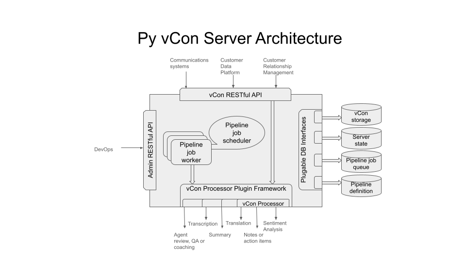

# The py_vcon_server Python Package

Please pardon the roughness of content here.  We are still under construction.

The first release and documentation coming soon.

The following is an overview of the Python vCon Server, architecture, components, configuration and use.
The documentation on this page assumes the reader has a rough understanding of what a vCon is and what you can do with them at least at a high level.
If that is not the case, you may want to start with [what is a vCon](../README.md#what-is-a-vcon).

## Table of Contents

  + [Overview of vCon Server](#overview-of-vcon-server)
  + [Terms](#terms)
  + [Architecture](#architecture)
  + [RESTful API Documentation](#restful-api-documentation)
    + [Admin RESTful API](#admin-restful-api)
    + [vCon RESTful API](#vcon-restful-api)
  + [Pipeline Processing](#pipeline-processing)
  + [vCon Processor Plugins](#vcon-processor-plugins)
  + [Access Control](#access-control)
  + [Building](#building)
  + [Installing and configuring](#installing-and-configuring)
  + [First Steps](#first-steps)
  + [Testing the vCon server](#testing-the-vcon-server)
  + [Extending the vCon Server](#extending-the-vcon-server)
  + [Support](#support)

## Overview of vCon Server

The Python vCon Server provides the ability to do the following:
  * Store, retrieve, modify and delete vCons
  * Perform operations on one or more vCons using a plugable framework of **vCon processors**
  * Run a single **vCon processor** via a RESTful API, using provided or stored vCons
  * Group a sequence of vCon operations (**vCon processors** to execute) and associated configuration into a **Pipeline** definition
  * Run a **vCon pipeline**, via a RESTful API, using provide or stored vCons
  * Queue vCon jobs for the **pipeline server** to run through **vCon pipelines**
  * Administer and monitor the server and configuration via an Admin RESTful API

The Python vCon server an be thought of as the aggregation of the following high level components:
  * [vCon RESTful API](#vcon-restful-api)
  * vCon Pipeline Server
  * [vCon Processor Plugin Framework](#vcon-processor-plugins)
  * [Admin RESTful API](#admin-restful-api)
  * Plugable DB Interfaces

## Terms
 * **vCon processor** - a **VconProcessor** is an abstract interface for plugins to process or perform operations on one or more vCons.  A **VconProcessor** takes a **ProcessorIO** object and **ProcessorOptions** as input and returns a **VconProcessor** as output.  The **VconProcessor** contains or references the vCons for the input or output to the **VconProcessor**.
 * **pipeline** - a **VconPipeline** is an ordered set of operations or **VconProcessors** and their **ProcessorOptions** to be performed on the one or more vCons contained in a **ProcessorIO**.  The definition of a **VconProcessor** (its **PipelineOptions** and the list of names of **VconProcessors** and their input **ProcessorOptions**) is saved using a unique name in the **PipelineDB**.  A **ProcessorIO** is provided as input to the first **VconProcessor** in the **VconPipeline**, its output **ProcessorIO** is then passed as input to the next **VconProcessor** in the **VconPipeline**, continuing to the end of the list of **VconProcessors** in the **VconPipeline**.  A **VconPipeline** can be run either directly via the **vCon RESTful API** or in the **Pipeline Server**.
 * **pipeline server** - the pipeline server runs **VconPipeline**s in batch.  Jobs to be run through a **VconPipeline** are added to a **JobQueue** via the **vCon RESTful API**.  The pipeline server is configured with a set of queues to tend.   The pipeline server pulls jobs one at time from the **JobQueue**, retrieves the definition for the **VconPipeline** for that **JobQueue** and assigns the job and **VconPipeline** to a pipeline worker (OS process) to run the pipeline and its processors and optionally commit the result in the **VconStorage** after successfully running all of the pipeline processors.
 * **queue job** - a queue job is the definition of a job to run in a **Pipeline Server**.  It is typically a list of one or more references (vCon UUID) to vCon to be used as input to the beginning of the set of **VconProcessors** in a **VconPipeline**.
 * **job queue** - short for **pipeline job queue**
 * **pileline job queue** - a queue of jobs to be run on the **pipeline server**.  The job to be run, is defined by the **pipeline definition** having the same name as the **job queue**.
 * **in progress jobs** - the **pipeline server** pops a job out of the the **pipeline job queue** to dispatch it to a worker to process the **pipeline definition**.  While the worker is working on the pipeline, the job is put into the **in process jobs** list.  After the job is completed, the job is then removed from the **in process jobs** list.  If the job was canceled, the job is pushed back to the front of the job queue from which it was removed.  If the job failed, the job is added to the failure queue if provided in the pipeline definition.
 * **pipeline worker** - thread or process in which the pipeline job is run.
 * **job scheduler** - dispatcher that pulls jobs to be run on a server and assigns the job to a pipeline worker.
 * **job** - short for **pipeline queue job**
 * **processor** - short for vCon processor
 * **queue** - short for job queue
 * **worker** - short for pipeline worker

    
## Architecture

    Components
      vCon RESTful API built on FASTapi
      Admin RESTful API built on FASTapi
      Pipeline Server

      Pluggable DB Interfaces
        VconStorage
        ServerState
        JobQueue
        PipelineDB
        
        PipelineIO
        Pipeline
        
      Processor Plugin Framework
        vCon Processor
  
      Concepts
        vCon locking
        ACL

## RESTful API Documentation
The full swagger documentation for all of the RESTful APIs provided by the Python vCon Server are available here: 
[RESTful/Swagger docs](https://raw.githack.com/py-vcon/py-vcon/main/py_vcon_server/docs/swagger.html)

## Admin RESTful API
The Admin RESTful APIs are provided for getting information about running servers, modifying configuration and system definitions.
These APIs are intended for administration and DevOps of the server.
They are organized in the following sections:

 * [Admin: Servers](https://raw.githack.com/py-vcon/py-vcon/main/py_vcon_server/docs/swagger.html#/Admin:%20Servers) -
for getting and setting server configuration and state

 * [Admin: Job Queues](https://raw.githack.com/py-vcon/py-vcon/main/py_vcon_server/docs/swagger.html#/Admin:%20Job%20Queues) -
for getting, setting, deleting and adding to **job queues**

* [Admin: Pipelines](https://raw.githack.com/py-vcon/py-vcon/main/py_vcon_server/docs/swagger.html#/Admin:%20Pipelines) -
for getting, updating and deleting **pipeline** definitions and configuration

 * [Admin: In Progress Jobs](https://raw.githack.com/py-vcon/py-vcon/main/py_vcon_server/docs/swagger.html#/Admin:%20In%20Progress%20Jobs) -
for getting, requeuing and deleting **in progress jobs**

## vCon RESTful API
The vCon RESTful APIs are the high level interface to the Python vCon Server, providing the ability to create and perform operations on vCons.
This the primary interface for users of the server, as opposed to administrators or DevOps.
They are organized in the following sections:

 * [vCon: Storage CRUD](https://raw.githack.com/py-vcon/py-vcon/main/py_vcon_server/docs/swagger.html#/vCon:%20Storage%20CRUD) -
for creating, updating, deleting, querying vCons in **VconStorage** and queuing **Pipeline Jobs** for vCons

 * [vCon: Processors](https://raw.githack.com/py-vcon/py-vcon/main/py_vcon_server/docs/swagger.html#/vCon:%20Processors) -
for running **vCon Processors** on vCons in **VconStorage**

 * [vCon: Pipelines](https://raw.githack.com/py-vcon/py-vcon/main/py_vcon_server/docs/swagger.html#/vCon:%20Pipelines) -
for running **Pipelines** on the given vCon or indicated vCon in **VconStorage**

## Pipeline Processing

## vCon Processor Plugins

  [Processor plugin framework and plugin instances README](py_vcon_server/processor/README.md)

    template for generated docs
      TOC
      iterate through processors and grab doc
      gather all init_options types and processor options types

## Access Control
We realize Access Control is an important aspect of the vCon Server.  The ACL capabilities of the vCon Server has been planned out and designed.  It will be implemented in the next release.

## Authentication and JWT

[Guide to authentication with fastAPI](https://dev.to/spaceofmiah/implementing-authorization-in-fastapi-a-step-by-step-guide-for-securing-your-web-applications-3b1l#:~:text=FastAPI%20has%20built%2Din%20support,resources%20or%20perform%20certain%20actions.)

## Building

## Testing the vCon Server

A suite of pytest unit tests exist for the server in: [tests](tests)

Running and testing the server requires a running instance of Redis.
Be sure to create and edit your server/.env file to reflect your Redis server address and port.
It can be generated like the following command line:

    cat <<EOF>.env
    #!/usr/bin/sh
    export DEEPGRAM_KEY=ccccccccccccc
    export OPENAI_API_KEY=bbbbbbbbbbbbb
    export HOSTNAME=http://0.0.0.0:8000
    export REDIS_URL=redis://172.17.0.4:6379
    EOF

The unit tests for the server can be run using the following command in this directory:

    source .env
    pytest -v -rP tests

## Installing and Configuring

The following installation and configuration instructions are intended for development and testing purposes only.
This is by no means instructions for a secure install.
These instructions are intended for a setup where the develer is running a Docker server on a local host.
It is most convenient to run two docker containers, one for the Redis server and a second for the vCon server.
The following instructions are for this configuration.

The [Dockerfile](docker_redis/Dockerfile) for the Redis server can be found in the [docker_redis](docker_redis) directory.
The following comments will build the image and run the container:
    cd docker_redis
    ./dockerctl.sh build
    ./dockerctl.sh run

The Redis server will be bound to to the Docker server host's network on the default Redis port (6379).
If you would like a shell on the Redis server container to use the Redis CLI to query the DB, the following will create a shell on the container:
    ./dockerctl.sh shell

If you do not setup your Redis server in the above configuration, you will need to setup your enviromental variables to indicate other wise with something like the following:
    VCON_STORAGE_URL=redis://<your_host>:<your_port>

For example:
    echo VCON_STORAGE_URL=redis://192.168.0.1:8765 >> testenv

The py_vcon_server can be run in another container or directly on the Docker server host.
This is a personal choice.
If you want to be able to run all of the unit tests and be able to take advantage of all of the vCon operations supported by the Python vCon and py_vcon_server packages, you will want to get API keys to use OpenAI and Deepgram services.
You can find [instructions on getting third party API keys here](../README.md#third-party-api-keys).

The network interface and port, upon which the vCon server Admin and vCon RESTful APIs, are exposed is configured with the REST_URL environment variable.

### Run py_vcon_server Package
If you are running the vCon server directly from the package, setup your environment like the following:
    cat << EOF >> testenv
    export REST_URL="http://<your_host_ip>:8000"
    export OPENAI_API_KEY="your_openapi_key_here"
    export DEEPGRAM_KEY="your_deepgram_api_key_here"
    EOF

To start the vCon server use the following commands:
    source testenv
    python3 -m py_vcon_server

### Run py_vcon_server From Cloned Repo
If you which to run the vCon server in a development mode, directly from the git clone, from the [py_vcon_server](.) directory, setup your environment variables using the following:
    cat << EOF >> testenv
    export PYTHONPATH=".:.."
    export REST_URL="http://<your_host_ip>:8000"
    export OPENAI_API_KEY="your_openapi_key_here"
    export DEEPGRAM_KEY="your_deepgram_api_key_here"
    EOF

To start the vCon server use the following commands:
    source testenv
    python3 -m py_vcon_server

## First Steps
   * [1. Installing and Configuring](#installing-and-configuring)
   * [2. Build a vCon](#build-a-vcon)
   * [3. Process a vCon](#process-a-vcon)
   * [4. Create and Use a Pipeline](#create-and-use_a-pipeline)
   * [5. Create a Job Queue and Queue a Job](#create-a-job-queue-and-queue-a-job)

### Build a vCon

There are a number of ways that you can build a vCon:

  * Use the [Python vCon](../README.md#installing-py-vcon) package [Command Line Interface (CLI)](../vcon/bin/README.md) in a Linux shell

  For example to create a vCon with a single audio recording dialog with an external reference to the audio file:`

    wget https://github.com/py-vcon/py-vcon/blob/main/examples/agent_sample.wav?raw=true -O agent_sample.wav
    vcon -i b.vcon add ex-recording agent_sample.wav "2023-03-06T20:07:43+00:00" "[0,1]"  https://github.com/py-vcon/py-vcon/blob/main/examples/agent_sample.wav?raw=true

  * Use the [Python vCon](../README.md#installing-py-vcon) package [library](../vcon/README.md) and write some Python code to create your own vCon

  * Create your own JSON vCon by hand or using other tools

  * Use an [existing vCon](../tests/hello.vcon)

### Process a vCon

Now that you have a vCon you can do something with it.
The py_vcon_server comes with a built in set of VconProcessor plugins that operate on vCons.
The processors are exposed via the vCon RESTful API.
The vCon Processor RESTful APIs require the vCon to be stored in in VconStorage in the server.
You can put your vCon in VconStorage by [posting it via the vCon RESTful API](https://raw.githack.com/py-vcon/py-vcon/main/py_vcon_server/docs/swagger.html#/vCon%3A%20Storage%20CRUD/post_vcon_vcon_post).
If your vCon contains or references a audio or video dialog, you might try the Whisper or Deepgram (requires API key from Deepgram) transcription processors as a first step.
If your vCon contains only text from email or messages, you might try the openapi_chat_complitions (requires API key from OpenAI) processor to produce a summary of the text.
Have a look at the [vCon Processor RESTful API Swagger documentation](https://raw.githack.com/py-vcon/py-vcon/main/py_vcon_server/docs/swagger.html#/vCon%3A%20Processors)

### Create and Use a Pipeline

In the prior step you performed a single operation or process on a vCon.
You can define a sequence of operations or processes to be performed on a vCon in what we call a Pipeline.
When we define a Pipeline, we name each of the Processors, in the order that they are to be performed, along with the options for each of the Processors in the sequence.
Here is a simple Pipeline definition.

    {
      "pipeline_options": {
        "save_vcons": true,
        "timeout": 10,
        "failure_queue": null,
        "success_queue": null
      },
      "processors": [
        {
          "processor_name": "deepgram",
          "processor_options": {
            "input_vcon_index": 0
          }
        },
        {
          "processor_name": "openai_chat_completion",
          "processor_options": {
            "input_vcon_index": 0
          }
        }
      ]
    }

It has two parts at the top level.
The pipeline_options and the processors sequence or list.
The pipeline_options apply to the whole Pileline.
The processors list defines the order of the processors to be run with the name of the processor and an optional set of options to provide when running that processor.
Pipelines are stored and modified using the [Admin RESTful API for Pilelines](https://raw.githack.com/py-vcon/py-vcon/main/py_vcon_server/docs/swagger.html#/Admin%3A%20Pipelines)
When you create a Pipeline, you assign it a unique name or key, that you use to refer to your Pipeline.
Now that you have created a Pipeline, you can test it out or push a single vCon through it using the [vCon Pipeline RESTful APIs](https://raw.githack.com/py-vcon/py-vcon/main/py_vcon_server/docs/swagger.html#/vCon%3A%20Pipelines)
You can use these RESTful APIs to run your vCon in VconStorage or provided as the body of your HTTP POST request through the Pipeline.

### Create a Job Queue and Queue a Job

Once you have tested your Pipeline line and are happy with its configuration, you may then want to run a bunch of vCons through it.
The py_vcon_server provides a job queuing capability for the Pipeline Server.
If you create a job queue with the same name as the Pipeline, jobs will be pulled from the queue one at a time and run through the Pipeline having the same name.
You create job queues using the [Admin Job Queue RESTful APIs](https://raw.githack.com/py-vcon/py-vcon/main/py_vcon_server/docs/swagger.html#/Admin%3A%20Job%20Queues).
You add jobs to the queue using the [iPUT queue vCon Storage CRUD API](https://raw.githack.com/py-vcon/py-vcon/main/py_vcon_server/docs/swagger.html#/vCon%3A%20Storage%20CRUD/add_queue_job_queue__name__put).
The py_vcon_server Pipeline Server will not start processing the jobs in you queue, until you configure the server to look at your queue.
The Pipeline Server only looks at the queue names which you configure using the [Admin Server Queue RESTful APIs](https://raw.githack.com/py-vcon/py-vcon/main/py_vcon_server/docs/swagger.html#/Admin%3A%20Servers).

## Extending the Vcon Server

TODO

## Support

Commercial support for the py_vcon_server is available from [SIPez](www.sipez.com)

